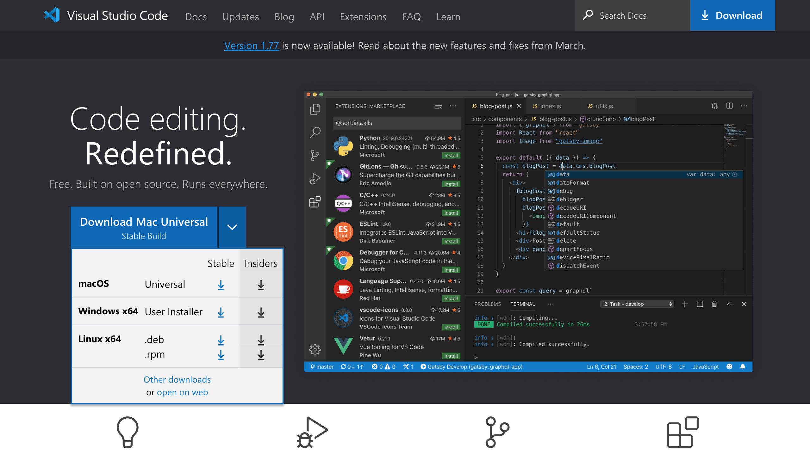
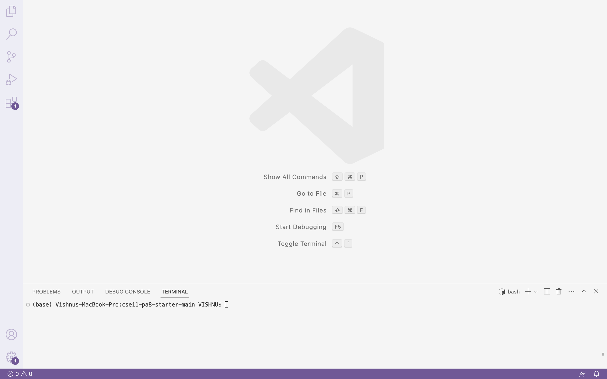
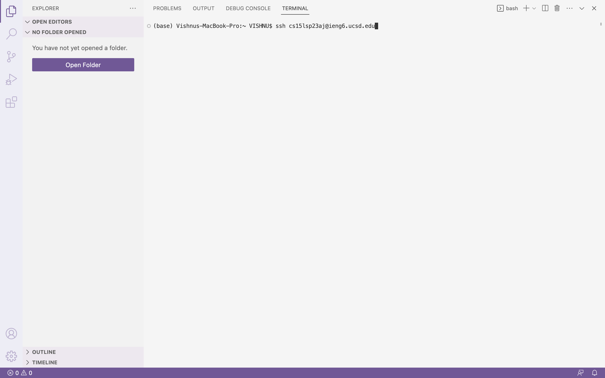
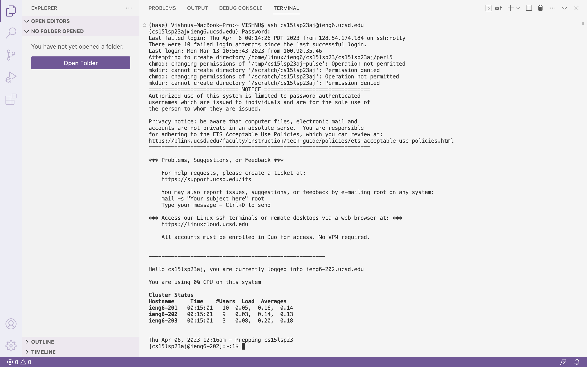
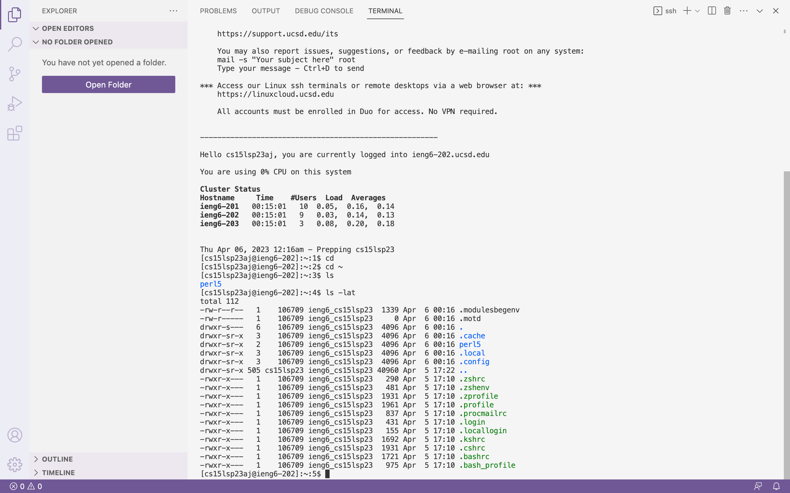
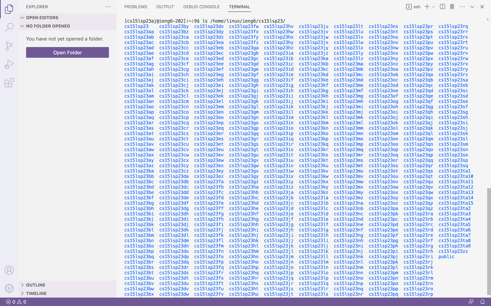

# Lab Report 1

In this blog, I am going to give you a tutorial on how to get remote access through a macOS computer. Acquiring remote access involves the following steps.

## 1. Accessing Your Course-Specific Account  
   * In order to access the remote server, you'll need to access your course specific account information for CSE 15L. And to do that you'll need to go to [Account Lookup](https://sdacs.ucsd.edu/~icc/index.php) and enter your details as shown in the picture below.


   * After your account is found, you'll see something like the image below. You'll be able to view your CSE 15L username. The username goes *"cs15lsp23xx"* where xx are specific to your username.


   * Click on the CSE 15L username and you should see a link where you can change your password as shown below.


***Don't forget to note down your username and password!***

## 2. Installing VS Code
   * To install Visual Studio Code, go to [VSCode](https://code.visualstudio.com/). Then, download the stable version for macOS.



   * After expanding the downloaded zip file, you'll be able to start the application. It should look somewhat similar to the following image.



## 3. Acquiring Remote Connection
   * Open a terminal on VS Code and enter the command as visible in the image below. The only difference is you'll need to change the last two letters of the username to match your's.



  * If this is the first time you've connected to the remote server, then you'll most likely see something similar to the following message:

```
The authenticity of host 'ieng6.ucsd.edu (128.54.70.227)' can't be established.
RSA key fingerprint is SHA256:ksruYwhnYH+sySHnHAtLUHngrPEyZTDl/1x99wUQcec.
Are you sure you want to continue connecting (yes/no/[fingerprint])? 
```

Type yes and continue to login with your course-specific account's password.
  * Once you're in the remote server, you'll see something like this:
  


## 4. Try Running Some Commands
  * Try running `$ ls -lat`. It lists out the contents in your current working directory.



  * If you run `$ ls /home/linux/ieng6/cs15lsp23/`, you would see all the usernames in your current CSE 15L class listed out.



There you go! You've just ran commands on a remote server!
