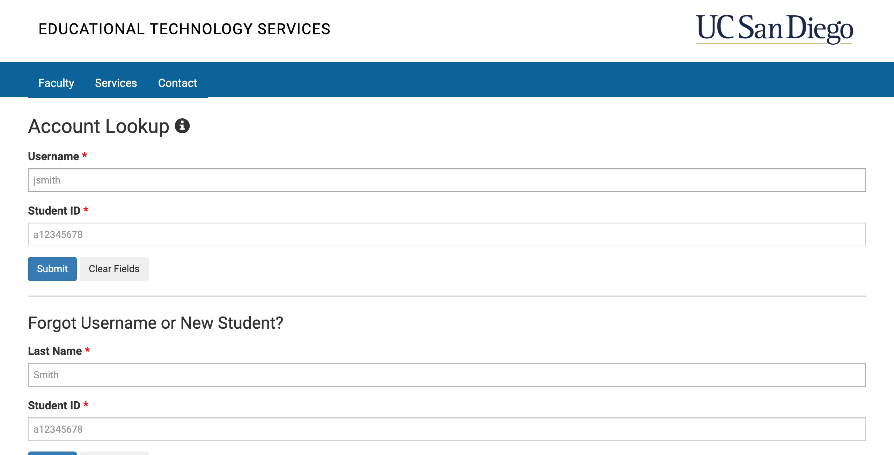
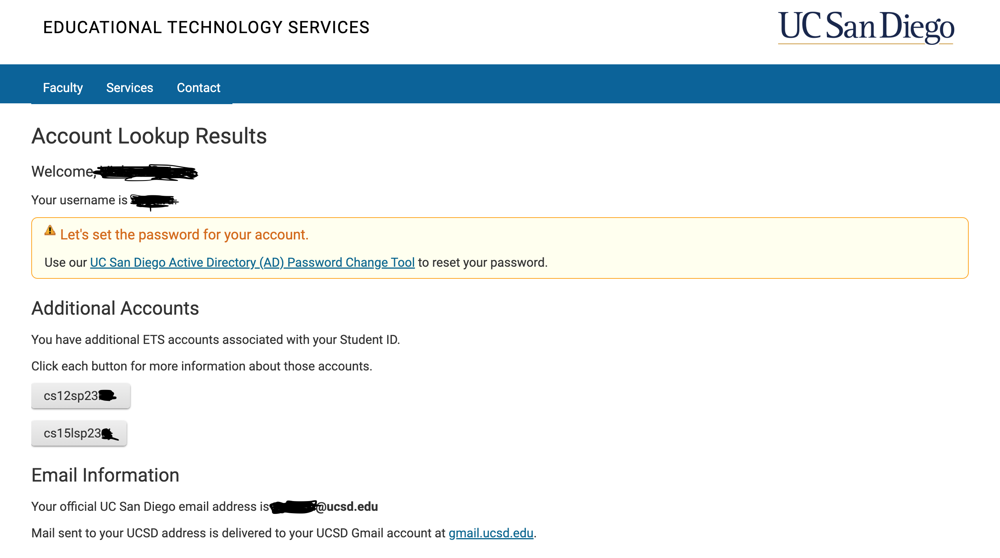
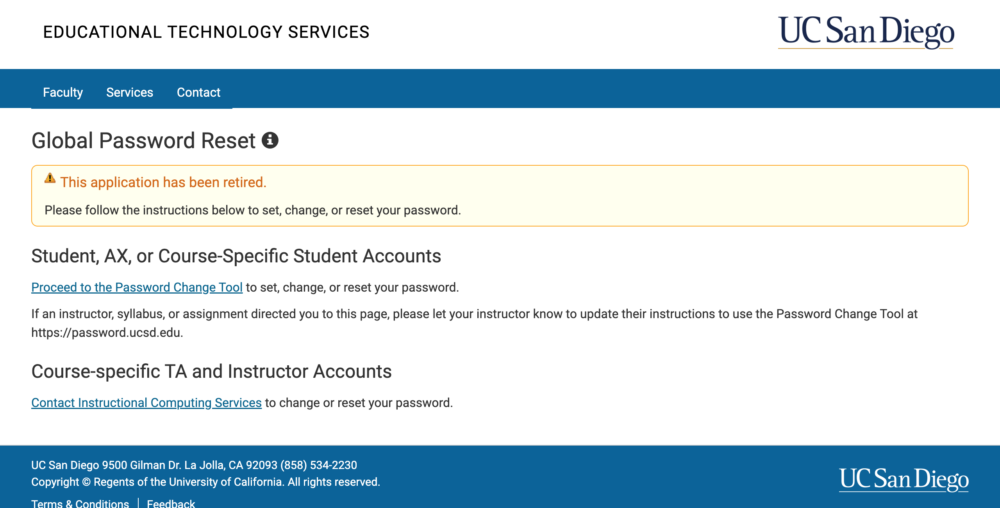

# Lab Report 1

In this blog, I am going to give you a tutorial on how to get remote access through a copmuter. Acquiring remote access involves the following steps.

## 1. Accessing Your Course-Specific Account  
In order to access the remote server, you need to access your course specific account information for CSE 15L. And to do that you need to go to [Account Lookup](https://sdacs.ucsd.edu/~icc/index.php) and enter your details as shown in the picture below.

After your account is found, you will see something like the image below. You will be able to view your CSE 15L username. The username goes *"cs15lsp23xx"* where xx are specific to your username.

Click on the CSE 15L username and you will be able to see a link where you can change your password as shown below.

Remember or note down your username and password!

## 2. Installing VS Code
