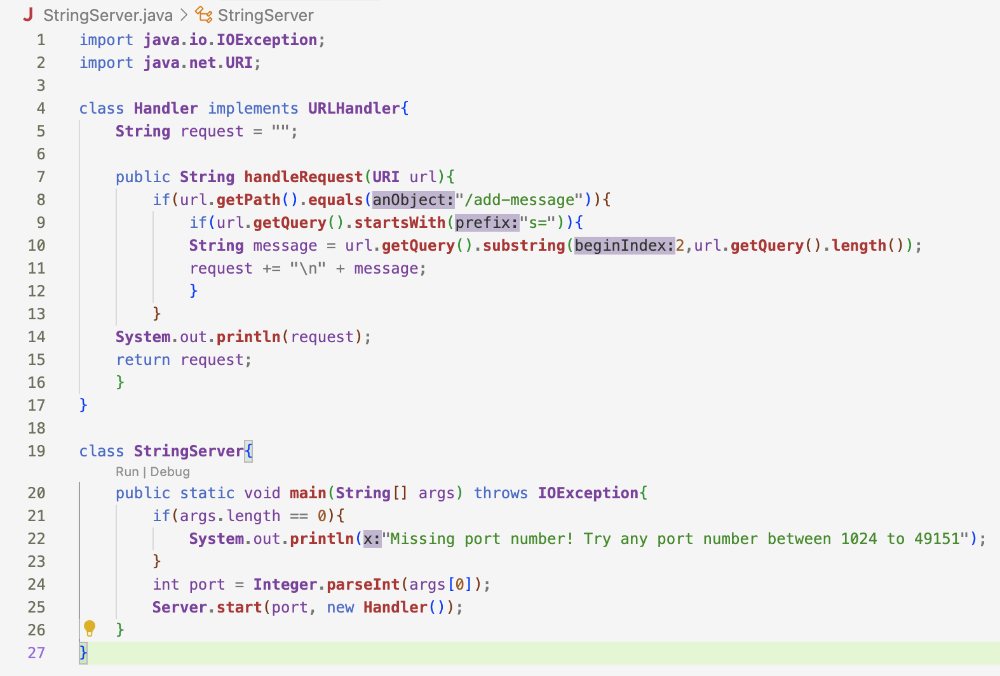
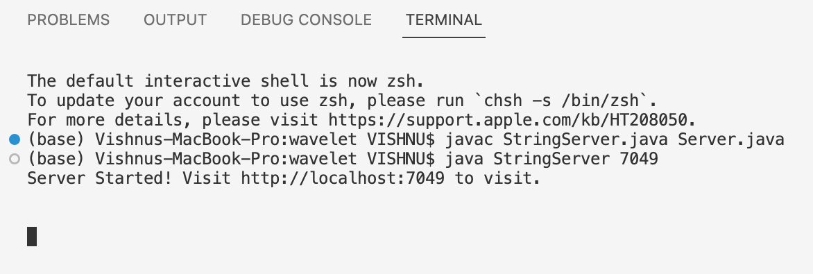
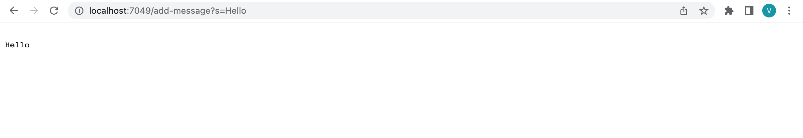
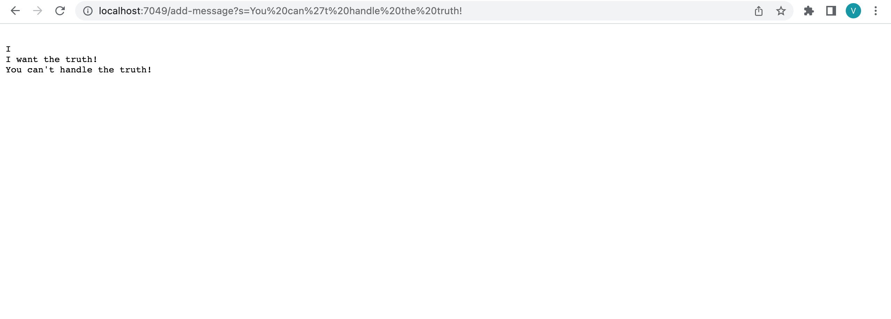
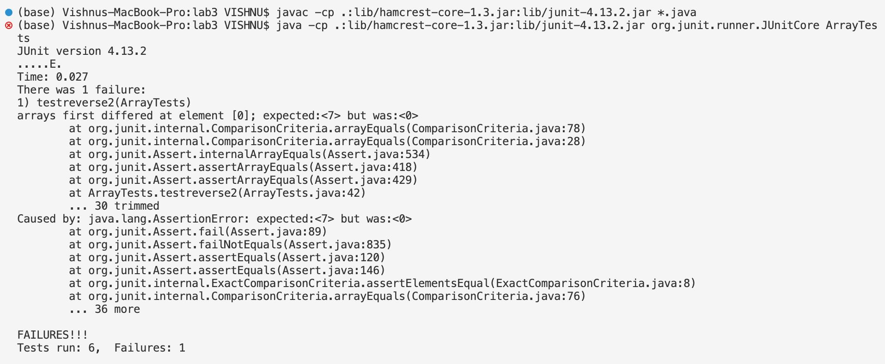

# Lab Report 2

This lab report will be showing how a web server is created and demonstrate a few operations on the web server. It will also focus on how a bug in a code must be dealt with systematically. 

# Part 1: Servers
  * Following is the code for StringServer.java. This is a program with a main method that creates a URLHandler that keeps track of a single string that gets added to by incoming requests, and uses Server.java to start a web server using that handler. It makes use of the `URLHandler` interface which builds URLs for links to content pages. The Handler class takes a URLHandler and starts up the server that listens for incoming connections.



  * The execution of StringServer.java is shown in the image below. The code is called using `javac StringServer.java Server.java` and then `java StringServer 7049`. **7049** is a port number. It doesn't necessarily have to be 7049, it can be any number between 1024 and 49151.



  * Here is an example of how the code is implemeneted on the web.



The main method in the StringServer class is called first. It checks if the argument is empty or not. Since it is not empty but has **7049** as the argument, it stores **7049** in the port field. It then generates a url.
When we enter this url on the web, the `handleRequest(URI url)` method is called. First, it checks if the path equals `/add-message` and the query starts with `s`. Then, it stores the "Hello" string in the message field and adds it to the request field. Finally, we print the desired string on the webpage. 

 * Here is another example. This time the code does a little more to give us a result.



The process is exactly the same in printing "I" as the previous example. The code, however, does a little more in the end to obtain more strings. When we enter the string "I want the truth!", this string gets stored in the message field and is added to the request field on a new line. When we print request we get both "I" and "I want the truth!" together but on different lines because they are stored in the request field. Likewise, as we type in more strings in the url, the strings are successively added to the request field and get printed together. The request field simply keeps track of all the strings that get iterated through the `handleRequest(URI url)` method.


# Part 2: Bugs
 * In the file ArrayExamples.java, the `reversed(int[] arr)` method is buggy. This method returns a new array with all the elements of the imput array in reversed order. The following is the code for the method.

```
static int[] reversed(int[] arr) {
    int[] newArray = new int[arr.length];
    for(int i = 0; i < arr.length; i += 1) {
      arr[i] = newArray[arr.length - i - 1];
    }
    return arr;
  }
```

The bug is in the line `arr[i] = newArray[arr.length - i - 1];`. The placement of arr and newArray must be interchanged and the method must return newArray. 

 * A failure-inducing point for the `reversed(int[] arr)` method is as follows.

```
Test 
  public void testreverse1(){
    int[] input = {51, 17, 49, 7};
    assertArrayEquals(new int[]{7, 49, 17, 51}, ArrayExamples.reversed(input));
  }
```

 * Here is an input that does not induce a failure.

```
@Test
  public void testreverse2(){
    int[] input = {0, 0, 0};
    assertArrayEquals(new int[]{0, 0, 0}, ArrayExamples.reversed(input));
  }
```

 * We get the following output after running both the tests.



The first test `testreverse1()` produces a failure. JUnit tells us that there was "0" in place of "7". In the code a new array of the same length as arr called newArray is created. There is a loop that goes through arr and changes the value of each element in arr to be equal to the element in the corresponding index of newArray in reverse order. However, all the elements in newArray are zeroes because there were no changes to this array since it was initialized. When arr is returned, it contains only zeroes.
The second test `testreverse2()` does not produce a failure because the input array has only zeroes. This method will always return an array of zeroes.

 * The fix is shown in the code below.

```
static int[] reversed(int[] arr) {
    int[] newArray = new int[arr.length];
    for(int i = 0; i < arr.length; i += 1) {
      newArray[i] = arr[arr.length - i - 1];
    }
    return newArray;
  }
```

This code is the same as the original one except that in this one each element of arr is added to the corresponding index of newArray in reverse order and this method returns newArray. This method works with all inputs. 

# Part 3: Reflection
In week 2, we learned how to create web servers and use code in java to augment the output shown on the URL's webpage. This was a pretty interesting thing that I didn't we could do using java. 
In week 3, we learned about the step-by-step process of debugging a code. I had some knowledge on debugging prior to this lab but I did not know the systematic process of doing it. Learning new terms such as failure-inducing point, symptoms, bugs, etc. and learning how to narrow down an unknown bug made debugging easier and more organized.
