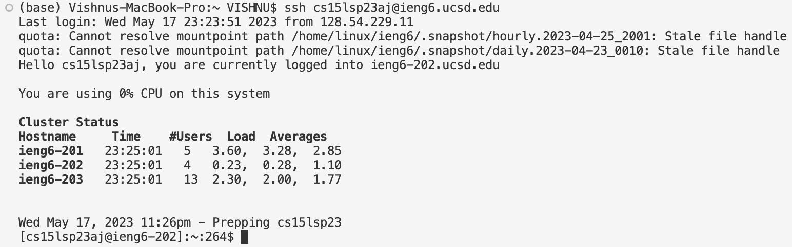
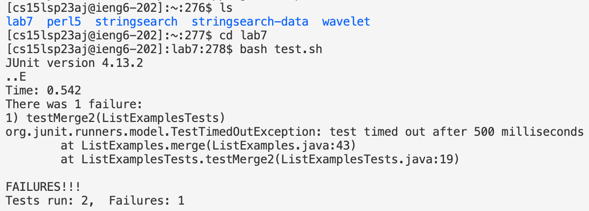
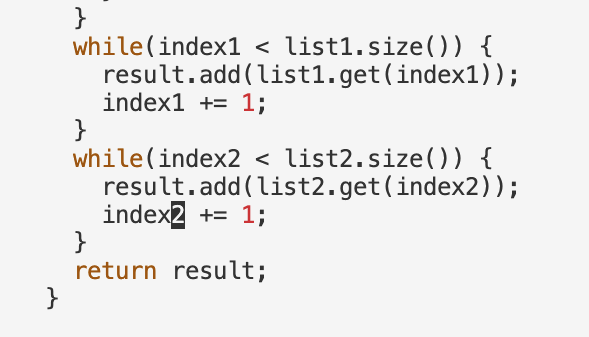
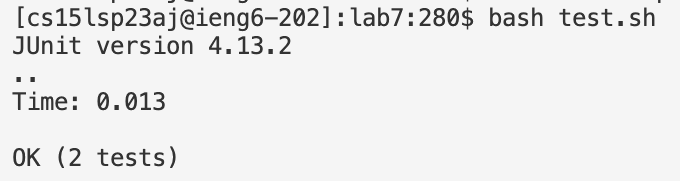
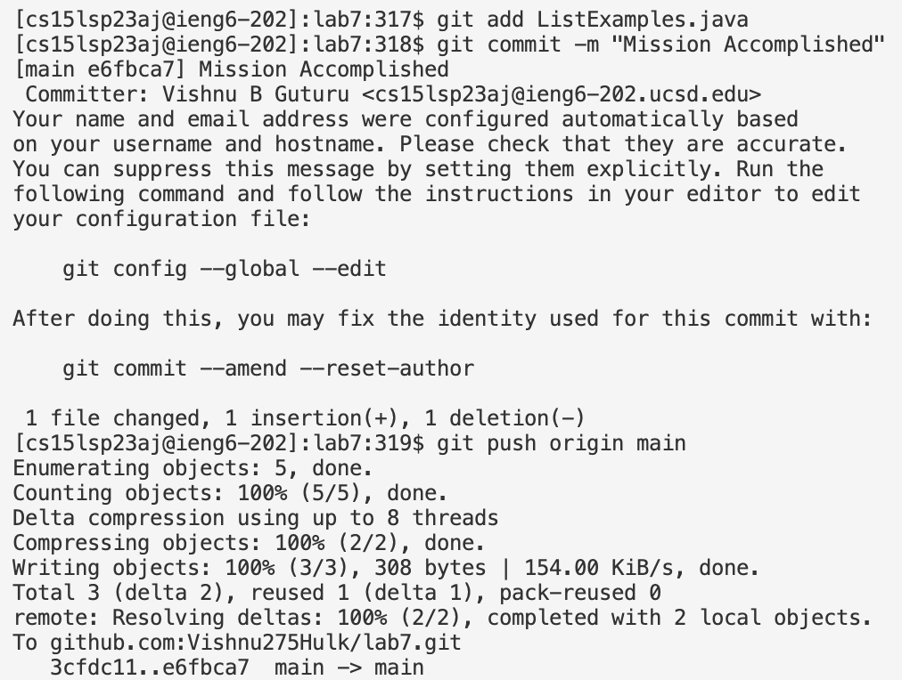
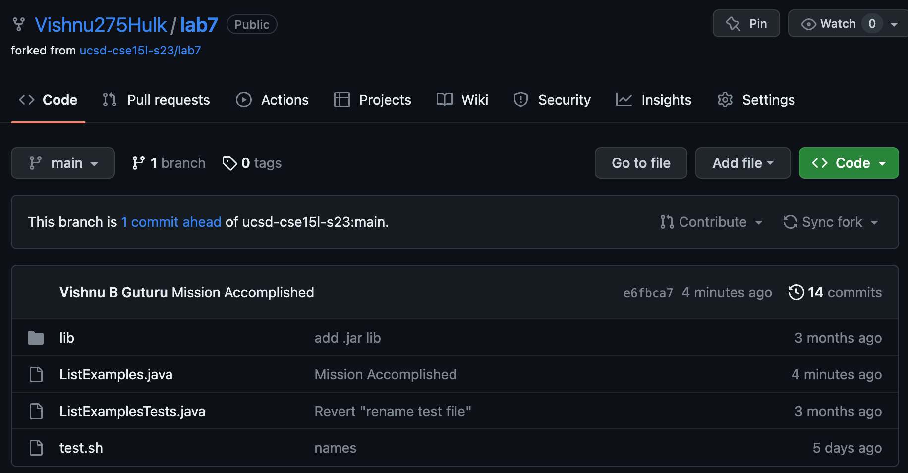

# Lab Report 4
This lab report will be focussed on using shortcut commands to conduct operations directly from the command line. 
This entails using vim for editing and git command line tools for cloning and pushing.
The description for the tasks is as follows.

# Task 1: Setup
Before operating from the command line, I setup the coding environment by deleting any existing forks of the desired repository and forked it again.

# Task 2: Logging Into ieng6
To log into my ieng6 account, I opened a terminal on VS Code and entered the command `ssh cs15lsp23aj@ieng6.ucsd.edu`. Then pressed `<enter>`.

# Task 3: Cloning Fork of the Repository
In order to clone the required repository I entered the command `git clone git@github.com:Vishnu275Hulk/lab7.git` and pressed `<enter>`.
This is a git command that clones any repository.

# Task 4: Running Tests
First, I used the command `ls` and pressed `<enter>` to verify that the repository has been cloned successfully.
Then, I ran the command `cd lab7` and pressed `<enter>` to get into the lab7 directory so that I can run the bash script test.sh from there.
I used the command `bash test.sh` and pressed `<enter>`.  The test results showed that there was one test that failed and one that passed.
The next task is to fix the code from the command line so that both the tests pass successfully.

# Task 5: Editing 
In order to edit the code, I had to open the file in vim. To do that I used the command `vim ListExamples.java` and pressed `<enter>`.
The keys I used to the edit the file are: 
  * `<down>` x 42 to reach the line that needs to be edited.
  * `<right>` x 11 to reach the exact location I need to edit.
  * `x` to delete the character "1".
  * `i` to enter INSERT mode. I entered "2".
  * `esc` button to exit INSERT mode.
  * `:wq` to save the changes and exit vim.

# Task 6: Running Tests Again
To crosscheck that my code fix works, I ran the tests again. This time I only used the command `bash test.sh`.
I didn't type out the entire command, instead used the `<up>` key twice and then pressed `<enter>`.
Since both the tests have passed, the code fix was successful!

# Task 7: Commiting And Pushing to Github
The last step is to commit and push the changes I have made to Github.
To accomplish that I entered the following commands and pressed `<enter>` after every subsequent command.
  * `git add ListExamples.java`.
  * `git commit -m "Mission Accomplished"` to commit the changes to Github.
  * `git push origin main` to push the changed file to Github.

The following image is from my Github account and it confirms that the changes made to ListExamples.java have been commited and pushed to Github main.

