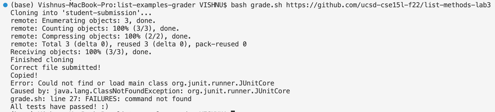
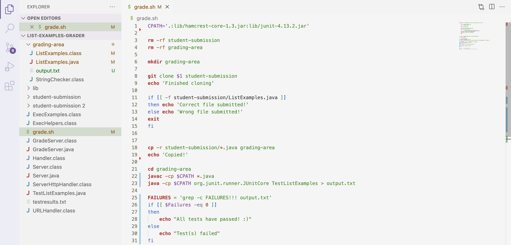

# Lab Report 5
This lab report will be all about describing the process of a TA debugging a block of code for a student.

# Student's Post
**What environment are you using (computer, operating system, web browser, terminal/editor, and so on)?**
I am using a macbook pro with the macOS operating system. I am coding on Visual Studio Code.

**Detail the symptom you're seeing. Be specific; include both what you're seeing and what you expected to see instead. Screenshots are great, copy-pasted terminal output is also great. Avoid saying “it doesn't work”.**
I made a bash script grade.sh that should work as a grader. When I run the command as shown on the terminal screenshot below, there are extra error lines produced in the output. Ideally, the bash script should give the same output without the one error lines. It should return "All tests have passed! :)" right after "Copied!". 

**Detail the failure-inducing input and context. That might mean any or all of the command you're running, a test case, command-line arguments, working directory, even the last few commands you ran. Do your best to provide as much context as you can.**
I am also attaching a screenshot of my bash script. I am unable to pinpoint the failure-inducing points in the code. I guess there is something wrong with class path and running Junit. I believe the error persists between the lines 20 and 26 of grade.sh.

# TA's Response
