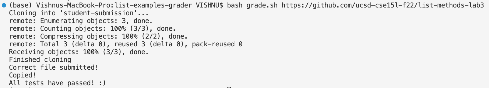
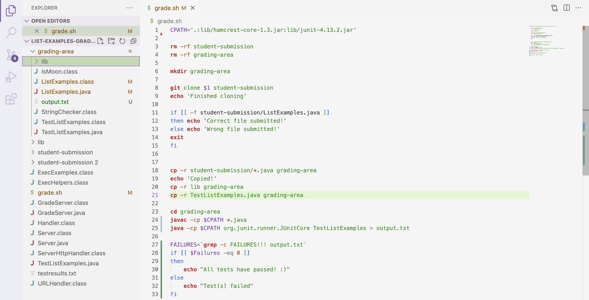

# Lab Report 5
This lab report will be all about describing the process of a TA debugging a block of code for a student.

# Student's Post
**What environment are you using (computer, operating system, web browser, terminal/editor, and so on)?**
I am using a macbook pro with the macOS operating system. I am coding on Visual Studio Code.

**Detail the symptom you're seeing. Be specific; include both what you're seeing and what you expected to see instead. Screenshots are great, copy-pasted terminal output is also great. Avoid saying “it doesn't work”.**
I made a bash script grade.sh that should work as a grader. When I run the command as shown on the terminal screenshot below, there are extra error lines produced in the output. Ideally, the bash script should give the same output without the error lines. It should return "All tests have passed! :)" right after "Copied!". 

**Detail the failure-inducing input and context. That might mean any or all of the command you're running, a test case, command-line arguments, working directory, even the last few commands you ran. Do your best to provide as much context as you can.**
I am also attaching a screenshot of my bash script. I am unable to pinpoint the failure-inducing points in the code. I guess there is something wrong with class path and running Junit. I believe the error persists between the lines 20 and 26 of grade.sh. Maybe I am missing some code.

# TA's Response
After going through the information you've provided, I can confirm there are two errors in your code. There is a syntax error in line 25, there shouldn't be a space between 'FAILURES' and '='. Also take a look at the quotes on line 25. 
Coming to the second error, you're missing some code after line 20. You are right, the error is with the class path. Since you are using Junit, you need to copy it to the grading-area directory. I believe the hamcrest jar files are in the 'lib' folder. The java file TestListExamples.java is not in the grading-area directory. Make sure you copy it to that directory before you run javac. If you run the code with all the files in the correct directory, your code should run successfully. Feel free to ask follow up questions if you are unclear about something.

# Student's Output After Help
I have made changes to my code as you've suggested. The code seems to work perfeclty now. It gives the desired output. I have copied the Junit lib and the TestsListExamples.java file to the grading-area using the `cp -r` command. Moreover, I've fixed the syntax error on line 25. That was the bug, I haven't copied the required files to the required directory. I was running the files from the wrong directory. That was the failure-inducing point.

# Infromation Needed About The Setup
The files TestListExamples.java and ListExamples.java that are being run along with the Junit library need to be in the grading-area directory. 
The contents of all the files remain the same except for grade.sh. The contents of grade.sh should be the same as shown in the screenshot provided in the Student's Post.
The command ran on terminal is `bash grade.sh https://github.com/ucsd-cse15l-f22/list-methods-lab3`, which produced the same errors as the student's code.
In the file grade.sh, the syntax error had to be corrected and the Junit library had to be copied to the grading-area directory along with the TestListExamples.java file, as the student had done after considering the TA's help.

# Reflection
I have learned quite a lot in this course. I think the skills I have developed in this course form the base foundation for whatever I will be learning and implementing in the coming years as a CSE student and a programmer. Some of the most interesting concepts I have learned are vim, bash scripts, terminal commands and debugging. For me, the coolest thing was to perform operations on the terminal with different files and directories using vim, bash scripts and a plethora of commands like cat, grep, find, and their corresponding options. I feel like getting used to these commands will exponentially reduce the amount of time I might spend on parsing through files and directories. Bash scripts prevent repetitive code. Making a bash script for implementing a grader similar to the autograder on gradescope is hands down the closest I've worked on a real world application. Using vim along with the other commands makes me feel like a pro at coding. Learning new stuff like this makes college interesting and fun.
